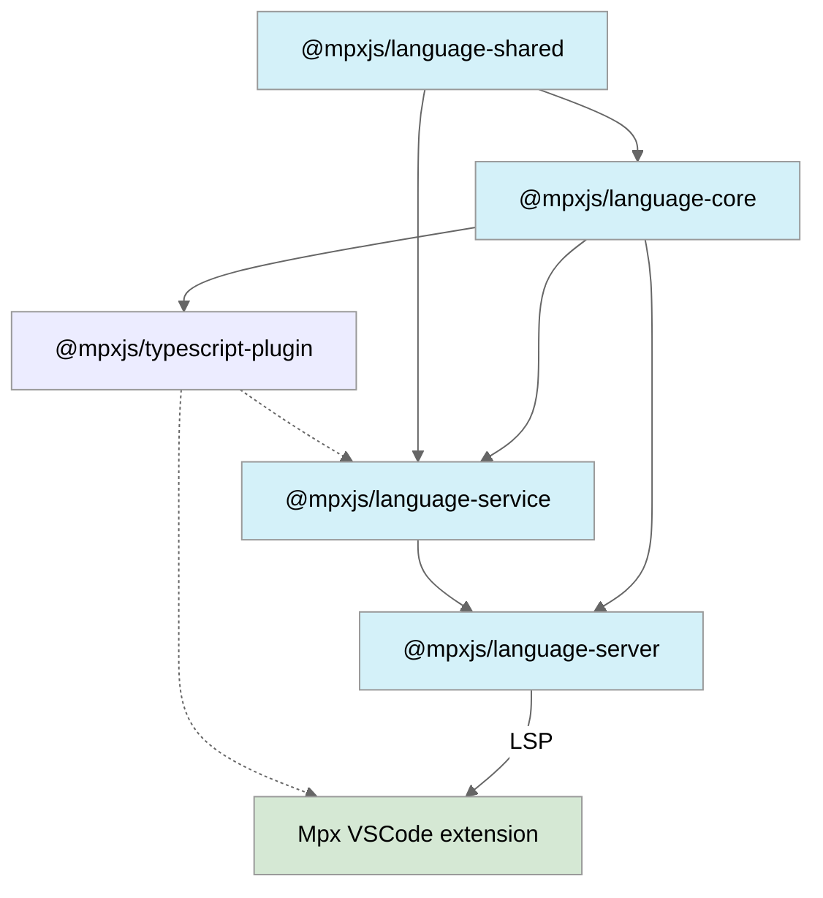

# Mpx Language Tools

[![vscode-market-version-badge]][vscode-market-mpx-official]
[![vscode-market-downloads-badge]][vscode-market-mpx-official]
[![open-vsx-version-badge]][open-vsx-mpx-official]
[![open-vsx-downloads-badge]][open-vsx-mpx-official]
[![license-badge]][license-url]
[][mpx-deepwiki]

## Why new Extension?

### Background

旧版插件 [vscode-mpx] 基于 Vue 2 的 [Vetur] 实现，目前维护不活跃，且存在功能局限性。另一款旧插件 [mpx-template-features] 针对 Mpx 模板补强了定义跳转等功能，但仍存在不足。随着 Vue 3 转向基于 [Volar] 的新插件 [Vue - Official][vue-official]，我们决定全新打造基于 [Volar] 的 Mpx 新版插件，提供更丰富的语言特性和更流畅的开发体验，以满足现代 Mpx 项目需求。

### Feature Comparison

| Feature                                      | Legacy | New           |
| -------------------------------------------- | ------ | ------------- |
| 语法高亮                                     | ✅     | ✅            |
| SFC blocks 语言支持                          | ✅     | ✅            |
| Emmet 支持                                   | ✅     | ✅            |
| 代码片段 snippets                            | ✅     | ✅ (enhanced) |
| 格式化 formatter                             | ✅     | ✅ (enhanced) |
| \<template\> 原生组件标签及属性补全提示      | ✅     | ✅ (enhanced) |
| 关联 tsconfig 配置                           | ✅     | ✅ (enhanced) |
| 支持 Monorepo                                | ❌     | ✅            |
| 支持选择 typescript 版本                     | ❌     | ✅            |
| SFC 编辑器视图拆分                           | ❌     | ✅            |
| \<template\> 支持 TS 类型检查、补全提示...   | ❌     | ✅            |
| \<template\> 支持定义跳转、查找参考引用      | ❌     | ✅            |
| \<template\> 样式类名跳转 \<style\>          | ❌     | ✅            |
| \<template\> style 属性支持原生 CSS 补全提示 | ❌     | ✅            |
| \<template\> 原生组件属性检查                | ❌     | ✅            |
| \<template\> 自定义组件跳转                  | ❌     | ✅            |
| \<json\> mpx json 语法 schema 支持           | ❌     | ✅            |

### More

更多关于新版本插件的详细功能介绍和使用说明，请参阅 [Wiki 文档][mpx-vscode-wiki]。

## Core Packages

| Package                                      | Version                                                        | Downloads                                                        | Description              | Changelog                        |
| -------------------------------------------- | -------------------------------------------------------------- | ---------------------------------------------------------------- | ------------------------ | -------------------------------- |
| [`vscode`][vscode-repo]                      | [![vscode-market-version-badge-1]][vscode-market-mpx-official] | [![vscode-market-downloads-badge-1]][vscode-market-mpx-official] | Mpx (Official) extension | [Changelog][changelog]           |
| [`@mpxjs/language-server`][server-repo]      | [![server-npm-version-badge]][server-npm-link]                 | [![server-npm-downloads-badge]][server-npm-link]                 | LSP server               | [Changelog][changelog-server]    |
| [`@mpxjs/language-service`][service-repo]    | [![service-npm-version-badge]][service-npm-link]               | [![service-npm-downloads-badge]][service-npm-link]               | Language service layer   | [Changelog][changelog-service]   |
| [`@mpxjs/language-core`][core-repo]          | [![core-npm-version-badge]][core-npm-link]                     | [![core-npm-downloads-badge]][core-npm-link]                     | Language core layer      | [Changelog][changelog-core]      |
| [`@mpxjs/language-shared`][shared-repo]      | [![shared-npm-version-badge]][shared-npm-link]                 | [![shared-npm-downloads-badge]][shared-npm-link]                 | Shared utilities         | [Changelog][changelog-shared]    |
| [`@mpxjs/typescript-plugin`][ts-plugin-repo] | [![ts-plugin-npm-version-badge]][ts-plugin-npm-link]           | [![ts-plugin-npm-downloads-badge]][ts-plugin-npm-link]           | TypeScript plugin        | [Changelog][changelog-ts-plugin] |

## Dependency Flow

## Contributing

For details on how to contribute to this project, please refer to our [Contributing Guide][contributing-guide].

## Dive In

For architecture details and source code documentation, please refer to our [Deepwiki][mpx-deep-wiki].

## RoadMap

For details on our planned features and future direction, please refer to our [Roadmap].

## Credits

- [vue-language-tools] & [Volar], created by [Johnson Chu].
- [vscode-mpx], a legacy VS Code extension for Mpx, created by [pagnkelly].
- [mpx-template-features], a legacy VS Code extension for Mpx template, created by [Soon Wang].

<!-- Reference Links -->

[vscode-mpx]: https://marketplace.visualstudio.com/items?itemName=pagnkelly.mpx
[mpx-template-features]: https://marketplace.visualstudio.com/items?itemName=wangshun.mpx-template-features
[vetur]: https://github.com/vuejs/vetur
[Volar]: https://github.com/volarjs/volar.js
[vue-official]: https://marketplace.visualstudio.com/items?itemName=Vue.volar
[vue-language-tools]: https://github.com/vuejs/language-tools
[mpx-deepwiki]: https://deepwiki.com/mpx-ecology/language-tools
[mpx-vscode-wiki]: https://github.com/mpx-ecology/language-tools/wiki
[roadmap]: https://github.com/mpx-ecology/language-tools/discussions/4
[Johnson Chu]: https://github.com/johnsoncodehk
[pagnkelly]: https://github.com/pagnkelly
[Soon Wang]: https://github.com/wangshunnn
[contributing-guide]: ./CONTRIBUTING.md
[license-badge]: https://img.shields.io/badge/license-MIT-blue
[license-url]: https://github.com/mpx-ecology/language-tools/blob/main/LICENSE

<!-- Package Links -->

[vscode-repo]: https://github.com/mpx-ecology/language-tools/blob/main/vscode
[server-repo]: https://github.com/mpx-ecology/language-tools/blob/main/packages/language-server
[service-repo]: https://github.com/mpx-ecology/language-tools/blob/main/packages/language-service
[core-repo]: https://github.com/mpx-ecology/language-tools/blob/main/packages/language-core
[shared-repo]: https://github.com/mpx-ecology/language-tools/blob/main/packages/language-shared
[ts-plugin-repo]: https://github.com/mpx-ecology/language-tools/blob/main/packages/typescript-plugin

<!-- Extension Links -->

[vscode-market-version-badge]: https://img.shields.io/vscode-marketplace/v/mpxjs.mpx-official?label=VS%20Code&style=flat
[vscode-market-version-badge-1]: https://img.shields.io/vscode-marketplace/v/mpxjs.mpx-official?label=Mpx%20(Official)&style=flat
[vscode-market-downloads-badge]: https://img.shields.io/vscode-marketplace/d/mpxjs.mpx-official?label=VS%20Code%20Downloads&style=flat&color=brightgreen
[vscode-market-downloads-badge-1]: https://img.shields.io/vscode-marketplace/d/mpxjs.mpx-official?color=brightgreen
[vscode-market-mpx-official]: https://marketplace.visualstudio.com/items?itemName=mpxjs.mpx-official
[open-vsx-version-badge]: https://img.shields.io/open-vsx/v/mpxjs/mpx-official?label=Open%20VSX&style=flat
[open-vsx-downloads-badge]: https://img.shields.io/open-vsx/dt/mpxjs/mpx-official?label=Open%20VSX%20Downloads&style=flat&color=brightgreen
[open-vsx-mpx-official]: https://open-vsx.org/extension/mpxjs/mpx-official

<!-- NPM Badge Links -->

[server-npm-version-badge]: https://img.shields.io/npm/v/@mpxjs/language-server/latest
[server-npm-downloads-badge]: https://img.shields.io/npm/dy/@mpxjs/language-server
[server-npm-link]: https://www.npmjs.com/package/@mpxjs/language-server
[service-npm-version-badge]: https://img.shields.io/npm/v/@mpxjs/language-service/latest
[service-npm-downloads-badge]: https://img.shields.io/npm/dy/@mpxjs/language-service
[service-npm-link]: https://www.npmjs.com/package/@mpxjs/language-service
[core-npm-version-badge]: https://img.shields.io/npm/v/@mpxjs/language-core/latest
[core-npm-downloads-badge]: https://img.shields.io/npm/dy/@mpxjs/language-core
[core-npm-link]: https://www.npmjs.com/package/@mpxjs/language-core
[shared-npm-version-badge]: https://img.shields.io/npm/v/@mpxjs/language-shared/latest
[shared-npm-downloads-badge]: https://img.shields.io/npm/dy/@mpxjs/language-shared
[shared-npm-link]: https://www.npmjs.com/package/@mpxjs/language-shared
[ts-plugin-npm-version-badge]: https://img.shields.io/npm/v/@mpxjs/typescript-plugin/latest
[ts-plugin-npm-downloads-badge]: https://img.shields.io/npm/dy/@mpxjs/typescript-plugin
[ts-plugin-npm-link]: https://www.npmjs.com/package/@mpxjs/typescript-plugin

<!-- Changelog -->

[changelog]: https://github.com/mpx-ecology/language-tools/blob/main/CHANGELOG.md
[changelog-vscode]: https://github.com/mpx-ecology/language-tools/blob/main/vscode/CHANGELOG.md
[changelog-server]: https://github.com/mpx-ecology/language-tools/blob/main/packages/language-server/CHANGELOG.md
[changelog-service]: https://github.com/mpx-ecology/language-tools/blob/main/packages/language-service/CHANGELOG.md
[changelog-core]: https://github.com/mpx-ecology/language-tools/blob/main/packages/language-core/CHANGELOG.md
[changelog-shared]: https://github.com/mpx-ecology/language-tools/blob/main/packages/language-shared/CHANGELOG.md
[changelog-ts-plugin]: https://github.com/mpx-ecology/language-tools/blob/main/packages/typescript-plugin/CHANGELOG.md
