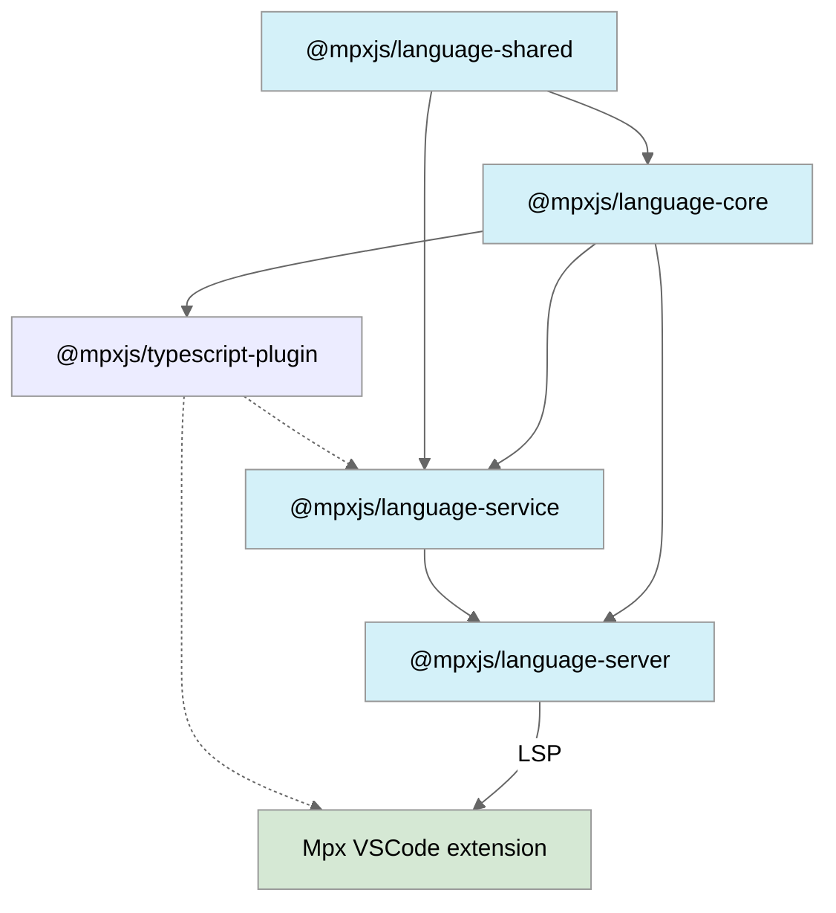

# Mpx Language Tools

<!-- etc. download icon -->

> 🚧 **Work in Progress**

## Why new Extension?

### Background

旧版插件 [vscode-mpx] 基于 Vue 2 的 [Vetur] 实现，目前维护不活跃，且存在功能局限性。另一款旧插件 [mpx-template-features] 针对 Mpx 模板补强了定义跳转等功能，但仍存在不足。随着 Vue 3 转向基于 [Volar] 的新插件 [Vue - Official][vue-official]，我们决定全新打造基于 [Volar] 的 Mpx 新版插件，提供更丰富的语言特性和更流畅的开发体验，以满足现代 Mpx 项目需求。

### Feature Comparison

| Feature                                    | Legacy | New               |
| ------------------------------------------ | ------ | ----------------- |
| 语法高亮                                   | ✅     | ✅                |
| SFC blocks 语言支持                        | ✅     | ✅                |
| Emmet 支持                                 | ✅     | ✅                |
| \<template\> 原生组件标签及属性补全提示    | ✅     | ✅ (enhanced)     |
| 格式化 formatter                           | ✅     | 60% (enhanced)    |
| 关联 tsconfig 配置                         | ✅     | ✅ (enhanced)     |
| 支持 Monorepo                              | ❌     | ✅                |
| 支持选择 typescript 版本                   | ❌     | ✅                |
| SFC 编辑器视图拆分                         | ❌     | ✅                |
| \<template\> 支持 TS 类型检查、补全提示... | ❌     | ✅                |
| \<template\> 支持定义跳转、查找参考引用    | ❌     | ✅                |
| \<template\> 样式类名跳转 \<style\>        | ❌     | ✅                |
| \<template\> 原生组件属性检查              | ❌     | in Progress (50%) |
| \<template\> 自定义组件跳转、属性检查      | ❌     | in Progress       |

### More

更多关于新版本插件的详细功能介绍和使用说明，请参阅 [Wiki 文档][mpx-vscode-wiki]。

## Core Packages

| Package                                  | Version             | Description            |
| ---------------------------------------- | ------------------- | ---------------------- |
| [`vscode`][mpx-vscode-readme]            | in Progress         | VS Code extension      |
| [`@mpxjs/language-server`][server-pkg]   | ![npm][server-npm]  | Language server        |
| [`@mpxjs/language-service`][service-pkg] | ![npm][service-npm] | Language service layer |
| [`@mpxjs/language-core`][core-pkg]       | ![npm][core-npm]    | Language core layer    |
| [`@mpxjs/typescript-plugin`][ts-pkg]     | ![npm][ts-npm]      | TypeScript plugin      |
| [`@mpxjs/language-shared`][shared-pkg]   | ![npm][shared-npm]  | Shared utilities       |

## Dependency Flow

## Dive In

For architecture details and source code documentation, please refer to our [deepwiki][mpx-deep-wiki].

## RoadMap

For details on our planned features and future direction, please refer to our [roadmap].

## Credits

- [vue-language-tools] & [Volar], created by [Johnson Chu].
- [vscode-mpx], a legacy VS Code extension for Mpx, created by [pagnkelly].
- [mpx-template-features], a legacy VS Code extension for Mpx template, created by [Soon Wang].

<!-- Reference Links -->

[vscode-mpx]: https://marketplace.visualstudio.com/items?itemName=pagnkelly.mpx
[mpx-template-features]: https://marketplace.visualstudio.com/items?itemName=wangshun.mpx-template-features
[vetur]: https://github.com/vuejs/vetur
[Volar]: https://github.com/volarjs/volar.js
[vue-official]: https://marketplace.visualstudio.com/items?itemName=Vue.volar
[vue-language-tools]: https://github.com/vuejs/language-tools
[mpx-deep-wiki]: https://deepwiki.com/mpx-ecology/language-tools
[mpx-vscode-wiki]: https://github.com/mpx-ecology/language-tools/wiki
[roadmap]: https://github.com/mpx-ecology/language-tools/wiki/Roadmap
[Johnson Chu]: https://github.com/johnsoncodehk
[pagnkelly]: https://github.com/pagnkelly
[Soon Wang]: https://github.com/wangshunnn

<!-- Package Links -->

[mpx-vscode-readme]: vscode/README.md
[server-pkg]: packages/language-server
[service-pkg]: packages/language-service
[core-pkg]: packages/language-core
[ts-pkg]: packages/typescript-plugin
[shared-pkg]: packages/language-shared

<!-- NPM Badge Links -->

[mpx-vscode-market]: https://img.shields.io/npm/v/@mpxjs/vscode-mpx
[server-npm]: https://img.shields.io/npm/v/@mpxjs/language-server
[service-npm]: https://img.shields.io/npm/v/@mpxjs/language-service
[core-npm]: https://img.shields.io/npm/v/@mpxjs/language-core
[ts-npm]: https://img.shields.io/npm/v/@mpxjs/typescript-plugin
[shared-npm]: https://img.shields.io/npm/v/@mpxjs/language-shared
